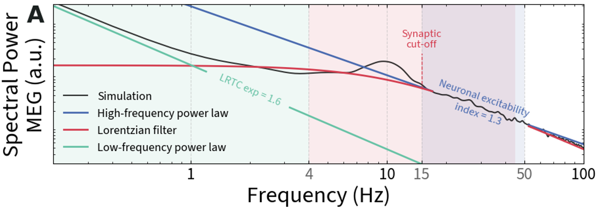

# Lorentzian Parameterization of MEG Power Spectra in Alzheimer’s Disease

## Overview

This repository implements and motivates a **Lorentzian parameterization of MEG power spectra** designed to study neurophysiological alterations in Alzheimer’s disease (AD).
It's ambition is not to give a full framework, but more as a proposition to study. It is partially derived from [FOOOF/Specparam](https://fooof-tools.github.io/fooof/), it is focused on the Lorentzian parameterization of the power spectrum.

## Why a Lorentzian model?

A Lorentzian spectrum emerges naturally from first order filters.

$$
\text{logPSD}(f) = A - \text{log}(1+(\frac{f}{f_c})^{-B})
$$

where:

-   $A$ reflects the gain
-   $f_c$ is a cutoff frequency linked to the **synaptic time constant**
-   $B$ controls the approximate power-law decay at high frequencies ($f >> f_c$)

## Implementation details

1. Fit a first <b>Lorentzian</b> to 4–45 Hz, then correct for chosen standard deviation of the residuals and fit a second <b>Lorentzian</b>
2. Fit peaks by taking the highest point in the residuals and iteratively fitting a Gaussian model until a stopping threshold (as in [FOOOF/Specparam](https://fooof-tools.github.io/fooof/))
3. Fit a <b>power-law</b> below 4 Hz in log–log space
